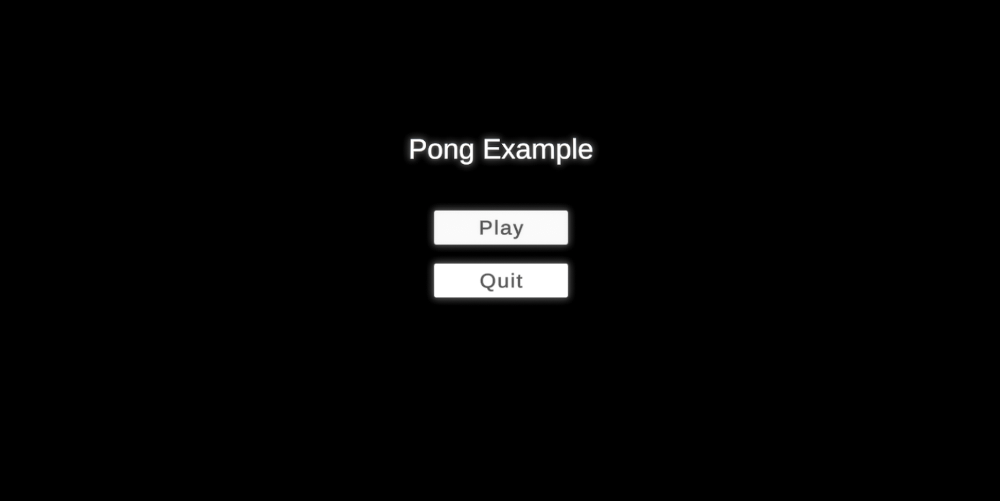
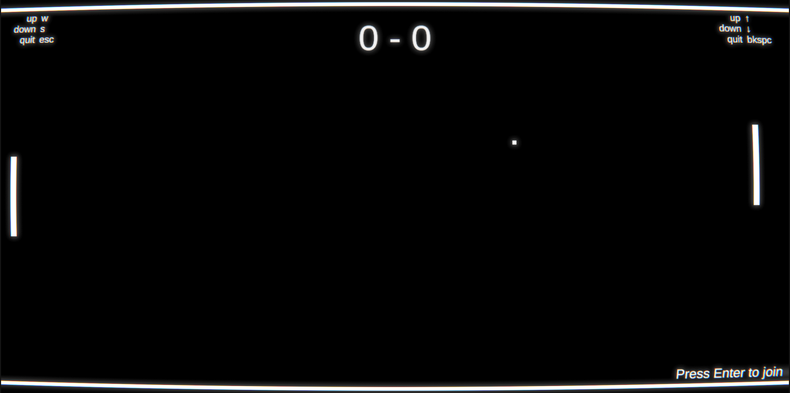
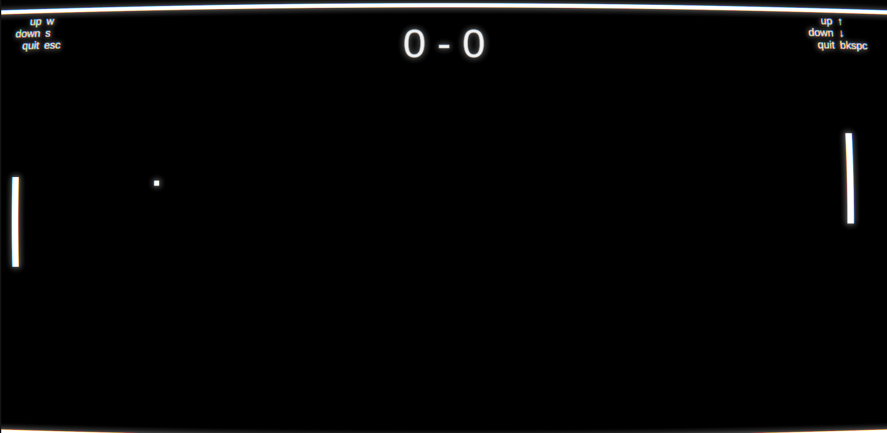

# UnityPongExample
A fully-commented example project for teaching new Unity learners abot code and project structure. YouTube series walking through the process of creating the project step-by-step coming soon. 

### Getting Started
To get started, download the project (the green "Code" button in the top right of the page, "download zip".) Unzip on the project somewhere convinient. Open it in Unity 2021.3.12f1. Other Unity versions aren't garunteed to work and will require a reimport. 

Play the game to understand the mechanics, then start by taking a look at PlayerPaddle.cs. 

### Features
Included features:
* Main menu
* Score text
* Local multiplayer
* AI opponent
* Particles

Covering topics such as:
* Inheritance
* Statics
* Vector math

 
  
 
